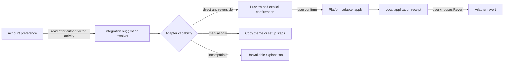

# Cross-environment theme sync design

**Status:** decision-ready design only. No automatic sync, suggestion delivery, preference endpoint, adapter application, migration, or production behavior is implemented by this document.

## Decision

DexThemes should model cross-environment continuity as three separate states:

1. **Preference** — the account's chosen theme intent.
2. **Suggestion** — a local integration notices that the preference differs from the current environment and offers a compatible action.
3. **Application** — the user explicitly confirms a platform-specific change and receives a reversible result.

A preference is never proof that an environment is installed, reachable, compatible, or themed. A suggestion never mutates the host. No connection, sign-in, startup, preference change, or background refresh may apply a theme automatically.

## Product decisions locked for v1

- One GitHub-backed DexThemes identity may connect multiple installed integrations. There is no account per harness.
- The account has at most one active theme preference. Absence of a row means no preference; existing users are not backfilled.
- Integrations pull the preference after authenticated user activity. The server does not push commands to hosts.
- Each adapter independently evaluates compatibility and produces either a suggestion, a manual handoff, or an unavailable explanation.
- **Apply** is shown only when a delivered runtime adapter can make the change and return a usable revert handle. Otherwise the action is **Copy theme** or **Prepare setup** with truthful manual steps.
- Application requires a fresh user gesture in the target environment. Confirmation names the theme, platform, variant behavior, and revert path.
- A successful direct application exposes **Revert** for as long as the owned layer exists. Applying a different preference first reverts or replaces only the layer owned by DexThemes.
- Preference selection and application are distinct controls. Applying locally does not silently change the account preference; an explicit **Use as my preference** action may do so.
- Suggestion dismissal is local to the integration and preference revision. It is not account-wide rejection and is not analytics-derived.

## Proposed architecture



The server owns preference intent and known theme identity. The installed integration owns host inspection, suggestion presentation, confirmation, application, and reversal. No generic server job can invoke a local adapter.

### Future additive account model

The first phase may add a `themePreferences` table; it does not exist today.

| Field | Purpose |
| --- | --- |
| `userId` | Existing DexThemes account identity |
| `themeId` | Stable public or account-visible theme reference |
| `themeRevision` | Immutable content/version reference used to detect staleness |
| `variantMode` | `system`, `light`, or `dark`; intent, not proof of host state |
| `accentId` | Optional bounded catalog accent identifier |
| `revision` | Monotonic preference revision for conflict and dismissal handling |
| `selectedAt` / `updatedAt` | Account timestamps |

The record must not contain theme payloads, prompt text, workspace data, host settings, adapter snapshots, credentials, bearer tokens, provider tokens, or analytics identifiers. Community-theme visibility must be rechecked on every read; a removed or newly private theme becomes stale rather than leaking cached content.

### Future additive endpoints

- `GET /me/theme-preference`: website-session read of the safe preference projection.
- `PUT /me/theme-preference`: website-session write with an exact theme revision and optimistic `expectedRevision`.
- `DELETE /me/theme-preference`: explicit account-level clearing.
- `GET /plugin/me/theme-preference`: read-only projection for an authenticated installed-integration session. The server derives user and integration from the bearer; neither is accepted in the request body.

These routes must use independent identity and network limits. API keys do not gain account-preference authority implicitly. MCP OAuth/Auth0, website GitHub OAuth, DeepSeek Device Flow, and current Codex behavior remain separate contracts.

### Adapter contract

Every platform adapter declares capabilities before UI copy is chosen:

```ts
type ThemeAdapter = {
  platformId: string;
  applicationMode: "direct_reversible" | "manual_handoff" | "unsupported";
  inspect(): Promise<{ currentThemeRef?: string; available: boolean; reasonCode?: string }>;
  resolveSuggestion(preference: SafeThemePreference): Promise<Suggestion>;
  preview(suggestion: Suggestion): Promise<PreviewResult>;
  apply?(suggestion: Suggestion, confirmation: UserConfirmation): Promise<ApplicationReceipt>;
  revert?(receipt: ApplicationReceipt): Promise<RevertResult>;
};
```

`resolveSuggestion` and `preview` are side-effect free. `apply` may run only from a fresh confirmation bound to the current preference revision and preview. A receipt contains a local opaque adapter handle, the preference revision, bounded theme/platform identifiers, and timestamps. Raw before-state or provider configuration stays inside the adapter and is never sent to the account API or analytics.

Adapter conformance requires idempotent replacement of the adapter's own layer, no mutation of unrelated user settings, bounded failure codes, and a tested revert path. If reversal becomes unavailable, the adapter must fail closed before apply or downgrade to manual handoff.

## Initial adapter boundaries

### DeepSeek Harness

- `applicationMode`: `direct_reversible` only inside the installed plugin.
- Suggest after an authenticated user opens DexThemes settings and the account preference differs from the adapter-owned active layer.
- Preview the paired palette locally.
- Apply only after the user chooses **Apply to DeepSeek** and confirms.
- Use the guarded runtime `overrideTokens` path and retain its disposer as the revert handle.
- **Revert** invokes that disposer and returns control to Harness's native theme.
- The standalone website cannot contact Harness and must not show a direct Apply claim.

### Codex

- `applicationMode`: `manual_handoff` under the current public contract.
- Offer **Copy theme**, confirm **Theme copied to clipboard**, open or explain Settings, and instruct **Appearance → Import theme**.
- Do not label this **Apply in Codex**, do not infer completion from copy, and do not claim a reversible application receipt.
- A future documented Codex runtime adapter must pass the same explicit-confirmation and revert requirements before this capability changes.

### Future environments

An environment is unsupported until a delivered adapter proves its current-version capability. URL schemes, filesystem conventions, generic MCP availability, or a prepared payload are not application proof. Manual adapters may generate bounded setup artifacts, but the user remains responsible for host-controlled import or selection.

## UX state model

| State | User-facing behavior | Mutation allowed |
| --- | --- | --- |
| No preference | Offer **Use as my preference** | Preference write after confirmation only |
| Preference current | Show **Matches your preference** | None |
| Suggestion available | Show theme/platform preview and **Review** | None |
| Manual handoff | Show **Copy theme** or **Prepare setup** and exact steps | Clipboard/setup artifact only after click |
| Incompatible theme/version | Explain why and offer a compatible preview if one exists | None |
| Theme stale or unavailable | Keep the host unchanged; ask the user to choose a current theme | Preference replacement/clear only |
| Disconnected | Explain that reconnection is required to compare or apply | Connection flow only |
| Offline | Keep the current host theme; allow retry | None |
| Awaiting confirmation | Name theme, platform, variant behavior, and revert result | Apply only on confirm |
| Applying | Disable duplicate actions; show progress | One adapter-owned operation |
| Applied | Show bounded receipt and **Revert** | Explicit revert or later explicit replace |
| Apply failed | Keep prior host state and show bounded recovery | Retry after a new confirmation |
| Revert failed | Preserve receipt and show recovery; never report success | Explicit retry |
| Suggestion dismissed | Suppress this integration/revision locally | None |

Changing an account preference invalidates older suggestions and pending confirmations. It does not alter an already applied host theme; that environment may later suggest the new preference.

## Privacy and security model

Allowed account data is limited to the safe preference fields above. Allowed Connected Apps evidence remains integration/platform ID, bounded plugin version, timestamps, and a bounded usage count. Application receipts and host inspection stay local.

Never collect or transmit:

- prompts, conversation history, generated prose, or workspace contents and paths;
- source files, host configuration, raw theme snapshots, clipboard contents, or arbitrary URLs;
- credentials, GitHub/provider tokens, plugin bearer sessions, API keys, or token hashes;
- free-form exceptions, account email, provider profile payloads, or Statsig user identity.

If analytics are later approved, they may contain only allowlisted event name, platform ID, bounded theme ID, variant mode, adapter/plugin version, preference revision class, and bounded result code. Analytics cannot decide whether an app is connected, whether a suggestion is shown, or whether an application succeeded.

Security invariants:

- user identity is always server-derived from the existing session contract;
- integrations read only the current user's safe projection;
- preference writes use optimistic revision checks to prevent stale overwrite;
- theme visibility and revision are revalidated at read and confirmation time;
- confirmations expire quickly and bind platform, theme revision, variant, and adapter version;
- application remains local, user-initiated, and reversible;
- disconnect revokes only the mapped integration authority and never triggers apply or revert.

## Migration and existing-user risk

Phase 1 is additive. Deploying a future optional table creates no preference rows and changes no host state. Existing accounts remain in **No preference**. Existing Connected Apps rows do not imply a preference. Existing Codex copies/imports, DeepSeek active layers, website sessions, MCP OAuth/Auth0, API keys, achievements, and Statsig data are not migrated or interpreted as preference evidence.

Primary risks are stale theme references, deleted community themes, two clients selecting concurrently, an integration reconnecting after a long absence, and adapter-version drift. Exact theme revisions, optimistic writes, visibility checks, local suggestion resolution, and fail-closed capabilities address those risks without a historical backfill.

## Phased acceptance tests

### Phase 0 — design only (current)

- No `themePreferences` table or preference endpoint exists.
- No startup, connection, account view, or background process applies a theme.
- Existing Codex, DeepSeek, OAuth, analytics, and Connected Apps tests remain unchanged except for documentation/contract coverage.

### Phase 1 — preference storage and account UI

- A signed-in user can explicitly set, replace, or clear one safe preference.
- Concurrent stale writes fail with a revision conflict and preserve the newer choice.
- Existing users and Connected Apps records remain empty of preference until an explicit action.
- Removed/private themes return a stale state without leaking theme content.
- No installed environment changes after any preference write.

### Phase 2 — local suggestions

- An authenticated adapter pulls preference only after user activity and shows a suggestion without changing the host.
- Current, incompatible, stale, disconnected, offline, and dismissed states match the table above.
- Dismissal is scoped to integration plus preference revision.
- Codex remains a truthful manual copy/import handoff.

### Phase 3 — explicit reversible application

- A direct adapter proves current capability and preview before enabling Apply.
- Apply requires a fresh bound confirmation; stale confirmation and adapter-version mismatch fail closed.
- Success produces a local receipt and working Revert; failure leaves the prior state intact.
- Duplicate apply is idempotent and cannot stack orphaned adapter layers.
- Server and analytics captures contain none of the prohibited data.

### Phase 4 — optional suggestion-on-connect

- Opt-in may cause a suggestion to appear after connection; default and opt-out produce no prompt.
- Connection never invokes apply, clipboard, file writes, or host configuration changes.
- Every application still follows Phase 3 confirmation and reversal.

## Release gate for any application work

Automatic application is out of scope. Phase 3 cannot begin until the target adapter has a delivered runtime, versioned capability contract, loaded-runtime Apply/Revert proof, privacy review, failure recovery, and explicit product approval. Source code, a prepared payload, a successful copy, or an installed identity alone is insufficient evidence.
